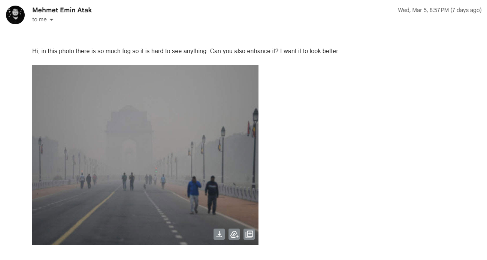
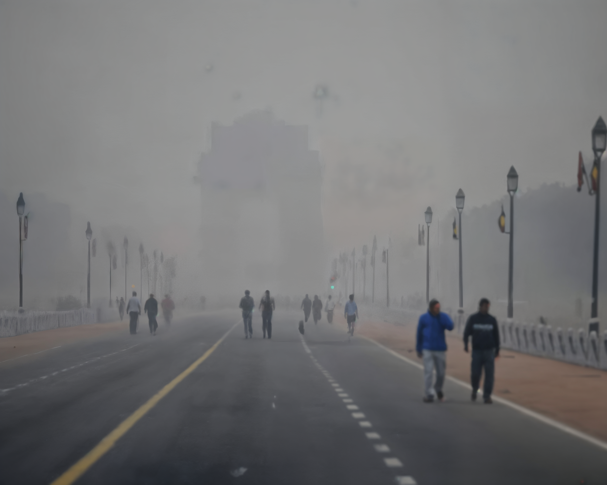

# AI Agent for Image Enhancing via Mail

In this project, we are going to develop an AI tool that looks for emails with images and then sends the processed images back to the user! We are going
to use OpenAI API for text processing and fal.ai for image processing tasks. Since this will be a serverless application, to host the endpoints, we are going to use Vercel. 
In order not to exceed the time limits for a Vercel function, we will use Upstash Workflow.

## Sample Usage of the AI Agent

All you need to do is sending an e-mail to agent4photo@gmail.com with an image as attachment. You are highly encouraged to give some prompts in the body or subject part of your email, in order to see
better results. 

 

The processed image will be sent to you after a couple of minutes. The output for the input above:

## Implementation

See [the page](src/README.md) please.

